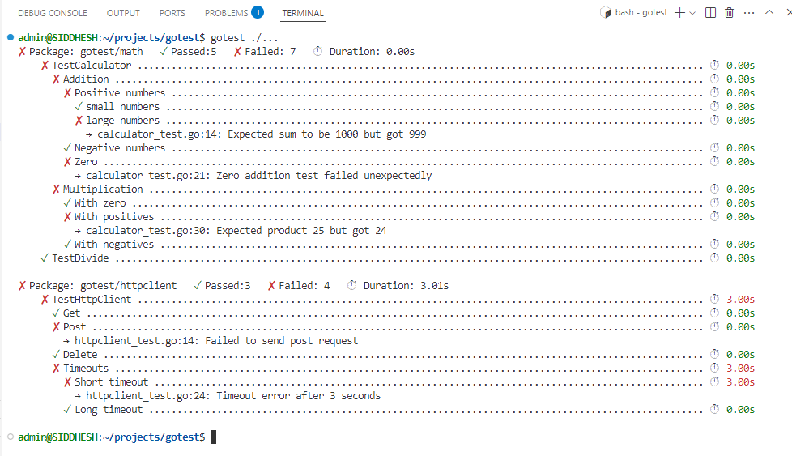

# gotest

🎯 A pretty formatter for `go test` — clean, colorful, and readable.  
A drop-in replacement for `go test -json` that shows test results beautifully without the need for piping.

---

## ✨ Features

- ✅ **Color-coded output** with ✔ Pass, ✘ Fail, ⚠ Skip
- 📂 **Grouped by package and file**
- 📄 **Clean formatting** of logs and errors
- 📊 **Summary view** at the end of test run
- 🔧 Accepts all `go test` flags (just like the original!)
- 🔜 **Upcoming flags**: `--fail-only`, `--no-color`, `--collapse`, `--watch`

---

## 📦 Installation

Install with:

```sh
go install github.com/siddhesh-tamhanekar/gotest@latest
```
or build manually
```sh
git clone https://github.com/siddhesh-tamhanekar/gotest.git
cd gotest
go build -o gotest
```

# 🚀 Usage
Use gotest just like you would use go test:

```sh
gotest ./...
gotest -v -run ^TestLogin$ ./auth
```
---

# 📊 Sample Output



---

# 💡 Why?
go test -json is great for tooling but noisy for humans.
gotest gives you readable, structured output while still supporting all the flexibility of go test.

---
# 🤝 Contributing
PRs and ideas are welcome! Feel free to open issues, feature requests, or fork and contribute.
--- 